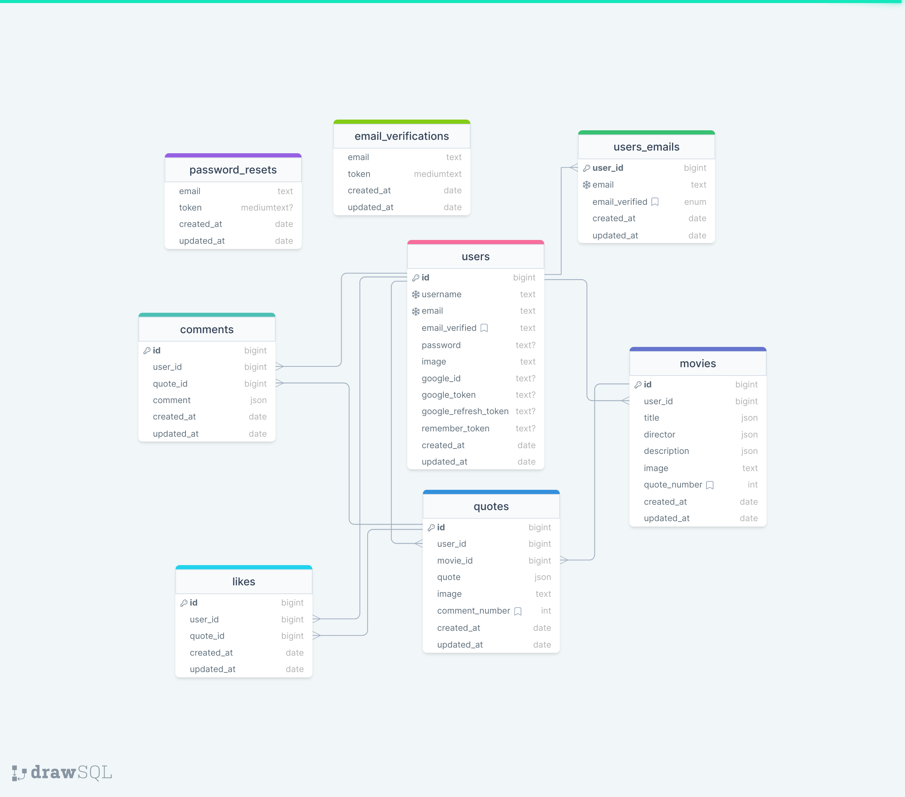

# Epic movie-quotes

## About App

Epic movie-quotes is website where you can register with your mail or google accaout, user must verify email before enter to news feed, then you can post movies ad quotes and edit or delete them. At news feed you will see other peoples quotes, you can search also for movies and quotes. User can like quote or write comment on quote. In profile page user can change profile photo, edit username or set new password, also user can add new email and after verification new email user can make it primary.

#
### Table of Contents
* [Prerequisites](#prerequisites)
* [Tech Stack](#tech-stack)
* [Getting Started](#getting-started)
* [Development](#development)
* [Database Design Diagram](#database-design-diagram)

#
### Prerequisites

*  *PHP@8.1 and up*
*  *MYSQL@8 and up*
*  *npm@6.14.17 and up*
*  *composer@2.4.1 and up*


#
### Tech Stack

*  [Laravel@9.x](https://laravel.com/docs/6.x) - back-end framework
*  [Spatie Translatable](https://github.com/spatie/laravel-translatable) - package for translation

#
### Getting Started
<br>

1\. First of all you need to clone Epic movie-quotes repository from github:

```sh
git clone https://github.com/RedberryInternship/giorgi-kikadze-epic-movie-quotes-api.git
```

2\. Next step requires you to run *composer install* in order to install all the dependencies.
```sh
composer install
```

3\. after you have installed all the PHP dependencies, it's time to install all the JS dependencies:
```sh
npm install
```

and also:
```sh
npm run dev
```
in order to build your JS/SaaS resources.

4\. Now we need to set our env file. Go to the root of your project and execute this command.
```sh
cp .env.example .env
```
And now you should provide **.env** file all the necessary environment variables:

5\. We need to storage link for public images.
```sh
php artisan storage:link
```

#
**MYSQL:**
>DB_CONNECTION=mysql
>DB_HOST=127.0.0.1
>DB_PORT=3306
>DB_DATABASE=*****
>DB_USERNAME=*****
>DB_PASSWORD=*****

#

after setting up **.env** file, execute:
```sh
php artisan config:cache
```
in order to cache environment variables.

4\. Now execute in the root of you project following:
```sh
  php artisan key:generate
```
Which generates auth key.

##### Now, you should be good to go!
<br>

#


### Development
<br>
You can run Laravel's built-in development server by executing:

```sh
  php artisan serve
```

when working on JS you may run:

```sh
  npm run dev
```
it builds your js files into executable scripts.
If you want to watch files during development, execute instead:

```sh
  npm run watch
```
it will watch JS files and on change it'll rebuild them, so you don't have to manually build them.
<br>


#

### [Database Design Diagram](https://drawsql.app/teams/kikalla/diagrams/epic-movie-quotes)
<br/>



<br />